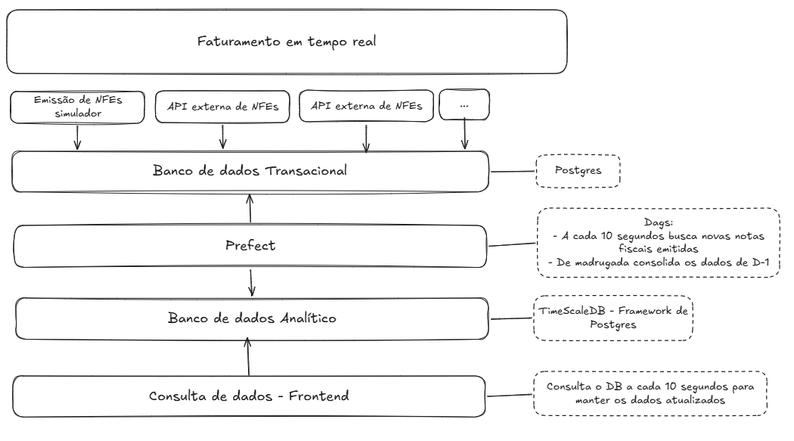

# Dashboard de Faturamento Analítico com NF-e

Este repositório organiza uma solução de dados em containers para gerar, processar e visualizar dados de Notas Fiscais Eletrônicas (NF-e) em tempo real. A arquitetura combina um simulador em Go, um banco transacional PostgreSQL, um pipeline de ETL orquestrado pelo Prefect, um banco analítico TimescaleDB, integrações em Go e um painel web em Next.js.



## Visão geral

O projeto é composto por:

- um simulador em Go que gera notas fiscais e grava dados no banco transacional;
- uma integração em Go que busca dados na FakeStore e insere notas no mesmo fluxo, ampliando as fontes de dados;
- um pipeline de ingestão e consolidação com Prefect;
- um banco analítico TimescaleDB para consultas rápidas e agregações;
- um frontend em Next.js para visualizar faturamento, histórico e comparação por mercado.

## Por que escolhemos cada tecnologia

- Go: utilizado no simulador e no integrador porque é uma linguagem leve, rápida e adequada para processos contínuos, scripts de longa execução e conexão com bancos.
- PostgreSQL: escolhido como banco transacional para armazenar as notas e itens gerados pelas integrações.
- Prefect: utilizado para orquestrar e automatizar o fluxo de ETL, com execução e agendamento dos pipelines.
- TimescaleDB: escolhido para o armazenamento analítico por ser otimizado para dados temporais e funcionar bem em dashboards em tempo real.
- Next.js: usado para construir o painel web com páginas e APIs que consomem diretamente o banco analítico.
- Docker Compose: empregado para orquestrar todos os componentes do ecossistema em um ambiente padronizado e reproduzível.

## Arquitetura

### 1. Camada de dados

- db_transacional: container com PostgreSQL 15, exposto na porta 5435.
  - Banco: nfe_db
  - Script de inicialização: [nfe_simulador/init.sql](nfe_simulador/init.sql)

- db_analitico: container com TimescaleDB, exposto na porta 6543.
  - Banco: analytics_db
  - Script de inicialização: [timescale_init.sql](timescale_init.sql)

### 2. Geração de dados

- simulador: serviço em Go que começa a carregar histórico e, em seguida, gera novas notas a cada 5 segundos.
- erp_integrador: serviço em Go que consulta a API FakeStore e escreve notas no mesmo modelo do simulador, com intervalo de 30 segundos.

### 3. Engenharia de dados

- prefect_server: interface e API do Prefect, exposta na porta 4200.
- prefect_worker: executa os fluxos do diretório [prefect/dags](prefect/dags).

### 4. Camada de apresentação

- frontend: aplicação Next.js exposta na porta 3000.
- Endpoints da API do frontend consultam o banco analítico e alimentam os gráficos e a tela de histórico.

## Pré-requisitos

Certifique-se de ter instalado no ambiente:

- Docker
- Docker Compose

## Instalação e execução

Na raiz do projeto, execute:

```bash
docker-compose up -d --build
```

Esse comando monta e sobe todos os serviços definidos em [docker-compose.yml](docker-compose.yml).

### Acesso após a inicialização

- Dashboard: http://localhost:3000
- Prefect: http://localhost:4200
- PostgreSQL transacional: localhost:5435
- TimescaleDB analítico: localhost:6543

## Configuração

As variáveis de ambiente já estão definidas no compose para os serviços principais:

- simulador e erp_integrador:
  - DATABASE_URL
- prefect_worker:
  - DB_ORIGEM
  - DB_DESTINO
  - PREFECT_API_URL
- frontend:
  - DATABASE_URL

Os valores padrão usados no projeto são:

- PostgreSQL transacional:
  - usuário: postgres
  - senha: postgres_password
  - banco: nfe_db

- TimescaleDB analítico:
  - usuário: analytics_user
  - senha: analytics_password
  - banco: analytics_db

## Fluxo de dados

1. O simulador e o integrador gravam notas e itens no banco OLTP.
2. O Prefect executa a extração e carga para o banco analítico.
3. O frontend consulta o banco analítico e atualiza o dashboard em tempo real.

## Estruturas criadas pelos scripts de inicialização

### Banco transacional

O script [nfe_simulador/init.sql](nfe_simulador/init.sql) cria:

- tabela notas
- tabela itens
- tabela controle_extracao
- índices para consulta por data e relacionamento entre notas e itens

### Banco analítico

O script [timescale_init.sql](timescale_init.sql) cria:

- extensão TimescaleDB
- tabelas de fatos para notas e itens
- hypertables para particionamento temporal
- tabelas para cotação diária e faturamento diário por mercado
- tabela consolidada de faturamento diário

## Pipelines do Prefect

Os fluxos estão definidos em [prefect/dags](prefect/dags):

- ingestao.py: pipeline de ingestão para o TimescaleDB.
- cotacoes_diarias.py: carga de cotações diárias de moedas.
- faturamento_diario_mercado.py: consolidação diária de faturamento por mercado.

O ponto de entrada do worker é [prefect/main.py](prefect/main.py), que também executa uma carga inicial imediata de cotações e consolidação antes de registrar os agendamentos.

## Comandos úteis

### Verificar serviços

```bash
docker-compose ps
```

### Ver logs

```bash
docker-compose logs -f simulador
docker-compose logs -f prefect_worker
docker-compose logs -f frontend
```

### Parar os serviços

```bash
docker-compose down
```

### Acessar os bancos

```bash
docker-compose exec db_transacional psql -U postgres -d nfe_db
docker-compose exec db_analitico psql -U analytics_user -d analytics_db
```

## Estrutura do repositório

- [docker-compose.yml](docker-compose.yml): definição dos serviços e portas
- [nfe_simulador](nfe_simulador): simulador de NF-e em Go
- [erp-integrador](erp-integrador): integrador com a FakeStore em Go
- [prefect](prefect): worker e DAGs do Prefect
- [frontend](frontend): aplicação Next.js com páginas e APIs
- [timescale_init.sql](timescale_init.sql): inicialização do banco analítico
- [nfe_simulador/init.sql](nfe_simulador/init.sql): inicialização do banco transacional
